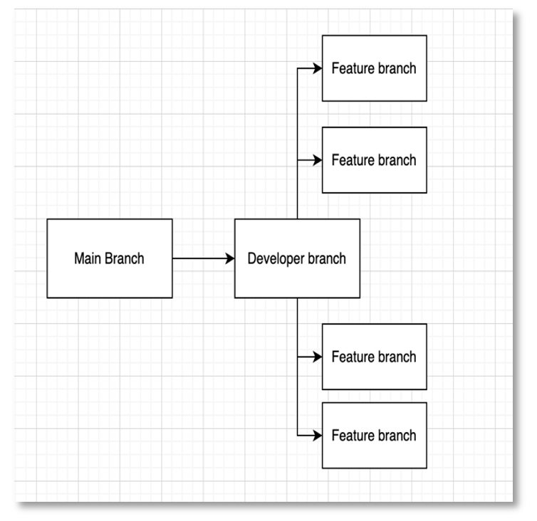

Process owner: Fredrik Hammarbäck (Development Manager), Oscar Söderlund (Technical Writer)

Reviewer: Madeleine Jacobsson (Process Manager), Adam Åström (R&D Line Manager)

Date: **TBA – THIS PROCESS IS NOT YET ACTIVE**

Latest update: 2022-09-20

# Git branching process: trunk-based development - Let’s git good

**About trunk-based development:**

Continuously integrating progress made by developers using this method is very similar to simple feature branching. The main difference is the frequency with which new branches are created, updated, integrated and closed. 
 
 

**How will the git structure look?**

The “Main Branch” will contain the absolute confirmed progress (version 1, version 2, etc.). This branch will be the least frequently updated branch.

The “Developer Branch” will be the most frequently branch and will be the base for continuous updating and branching.

The “Feature Branch”(es) will be temporary branches created for very specific tasks by each developer working on the task. Once tasks are completed, the branches will be terminated.
 
 
**Why should we use this Git strategy?**

If trunk-based development is used successfully, the developer branch will be continuously updated and the developers respective feature branches will most often contain the latest updates on the developer branch. Since all merge conflicts are solved by each developer on their working branch, no single person will be responsible for or approving all merges. This makes version handling very easy since the developers will handle conflicts that are related to what they themselves are working on at the moment.
 
 

**How will the flow of version handling look?**

Pulling and merging occurs frequently. Pulling before merging is crucial to solving and avoiding merge conflicts.

 
 
**How does trunk-based development work for you, the developer?**
 
Whenever you are to continue or start working on a feature or any coding task, following these steps will ensure that you and your fellow developers maintain and work on the latest version of our product. 

1. Before you start working on a task, branch out from the Developer Branch and name your new branch after your task. If, for example, you are to start working on a function that allows for editing of user information, simply name the branch “feature/edit-user-info”. Checking out using the command *git checkout -b “feature/edit-user-info”.*
1. After some time of coding (about once an hour), update your branch with what has changed in the developer branch. This is done using the command *git pull origin dev* where “dev” is the name of the developer branch.
1. Pulling from the developer branch will sometimes result in merge conflicts. As long as the different branches are working on different things, these conflicts are usually solved very quickly by simple clicking “accept incoming changes”. If there is some overlapping or conflicting code, further investigate and solve merge conflicts until none remain. 
1. Whenever you feel it’s time to commit and save your progress, simply follow these steps:
   1. Git pull origin dev (and solve for eventual merge conflicts)
   1. Git status.
   1. Git add <<files you have edited>>
   1. Git commit -m ”<<descriptive comment>>”
1. The commits you make during your work should be merged often (once a day or more depending on the amount of changes).
1. When you have completed your task, repeat steps 1-5 and merge one final time and delete the branch. Performing a branch deletion while merging can be done by ticking the box asking if you wish to delete your source branch while merging.
 
 

**How will simultaneous coding work in practice?:**

Developing branches will continuously receive and submit progress from and to other branches. In the example case above, the second pull to branch A will contain merged changes made on branch B. Each pull that contains changes to the developer branch might cause conflicts. If the task division between developers is clear, conflicts rarely happen.

# Instruction of how to use process 

**We use the following GitLab repo for our code:**

<https://gitlab.liu.se/tddc88-2022/c4/rdx-solutions-backend-project>

**How to see our branches:** 

For an overview of the branching structure of the repo, press Repository in the menu on the left-hand side. Press Graph (as seen in the below figure).

You will be met with a graph of the current branches, where the latest commits are presented at the top, see the image below. Note that this image is taken from Stack Overflow, our graph will look a bit different.

## Some useful commands:

**You can propose changes** (add it to the Index) using the command: 

*git add <filename>* 

**You can add several files at once** if you want to by using one of the following commands:

*git add <filename1> <filename2> ... <filenameN*>, several files separated by spaces

*git add -A*, stages all changes

*git add .*, stages new files and modifications, without deletions (on the current directory and its subdirectories).

*git add -u*, stages modifications and deletions, excluding new files.

**If something goes wrong.**

If you are in need of comparison between your current branch and the developer branch, using the command *git checkout <<name of the developer branch>>* will move you to the developer branch. Make sure you commit the changes in your own feature branch before switching branch or else you will lose the progress you have made locally.  

Should you be unable to resolve any eventual conflict in your branch or need help with version control, contact the configurations team and ask for help. Be sure to never merge any branch containing unresolved issues. 

**Some other useful commands for resolving issues with your version handling are:**

_Git stash**,**_ **Your changes will then be “saved for later”** and can be fetched later to the active branch using:

*git stash apply,* the stored changes can then be deleted from the stash using:

*git stash drop*

**If you mess up your versions big time**, it might be a good idea to revert your version to a specific commit by using

*git revert <commit id>*

**The commit id** can be found by using the command

*git log*

and find ex. “commit f668c5f186aeb35f0fff5049c847ef2056512290”, where the commit id is the long string of letters and numbers.

